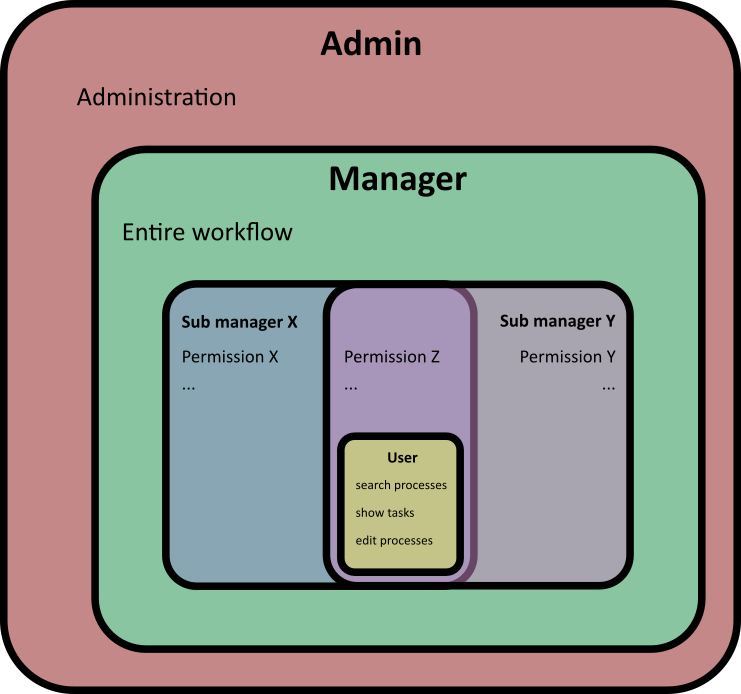

Role Management
===============
The access control will be purely authorization-based,
without predefined user groups. The user groups are only created by the user
(or administrator) himself, whereby the various authorizations are
then assigned and stored in the database. 
For this approach, all necessary authorizations must be defined
in the conception.

For example:
* canReadAll / canWriteAll
* canReadUsers / canAddUser / canDeleteUser
* canReadUserGroups / canAddUserGroup / canDeleteUserGroup
* canReadProcesses / canAddProcess / canDeleteProcess
* canReadProcessTemplates / canAddProcessTemplate / canDeleteProcessTemplate
* …

This allows to create several sub-management roles that share certain
authorizations but also have their own authorizations:

Database
========

For this approach, the following changes must be done to the database:

New table "authorizations" which holds all the predefined authorizations and should not bee editable during production:

|id (int)|title (varchar)|
|:---:|---|
|1|canReadAll|
|2|canWriteAll|
|3|canReadUsers|
|4|canAddUser|
|...|...|
 
Delete unnecessary column "permission" at table "userGroups":
 
|id (int)|title (varchar)|
|:---:|---|
|1|Admin|
|2|UserManagement|
|3|ProcessManagement|
|...|...|

New table "userGroups_x_authorizations":

|userGroup_id (int)|authorizations_id (int)|
|:---:|:---:|
|1|1|
|1|2|
|2|3|
|2|4|
|...|...|

The existing tables "user" and "user_x_userGroups" does not need to be changed.

Authorization
=============
On frontend side, all relevant HTML elements must be hidden and the access to
relevant URLs must be denied, if the users user group does not have the corresponding
authorization.