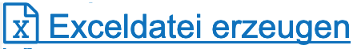

# Aktionen

Aktionen sind in diesem Abschnitt definiert als Befehle, die ausgelöst werden können und die eine Auswirkung nach sich ziehen. In diesem Abschnitt werden die Aktionen mit den jeweiligen Schaltflächen, durch die sie ausgelöst werden, vorgestellt. Somit kann der Abschnitt auch genutzt werden, um Unklarheiten hinsichtlich der Interpretation der Symbole zu beseitigen.

## Globale Aktionen:

Die globalen Aktionen erscheinen in allen Bereichen von Kitodo.Production und sollen im Folgenden dargestellt und beschrieben werden:

*  Bearbeiten
*  Löschen
*  Duplizieren
*  Anzeigen
*  Archivieren
* EINS STATISTIK? 

## Spezifische Aktionen:

*  Bearbeitungsstatus hochsetzen
*   Bearbeitungsstatus runtersetzen
*   Im Homeverzeichnis verlinken
*   Verlinkung aus Homeverzeichnis entfernen
*   Export DMS
*   Exceldatei erzeugen
*   PDF erzeugen

